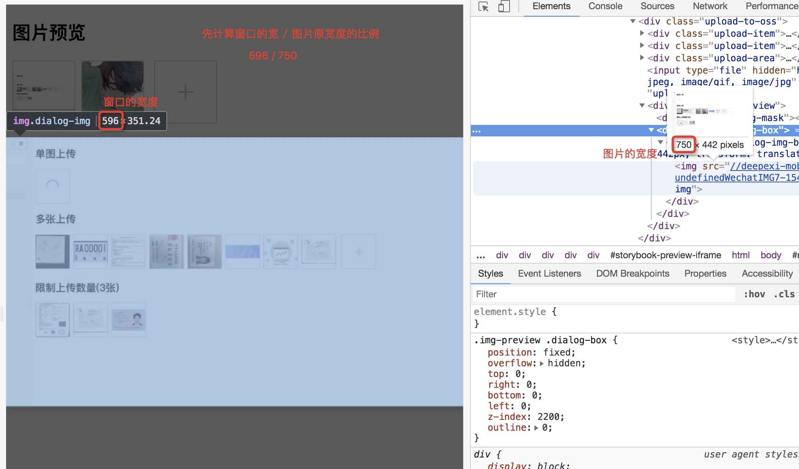
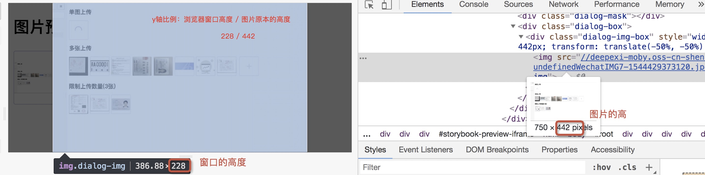

# img-preview

[](https://www.npmjs.com/package/@femessage/img-preview)[](https://www.npmjs.com/package/@femessage/img-preview)
[](https://github.com/FEMessage/img-preview/blob/master/LICENSE)
[](https://github.com/FEMessage/img-preview/pulls)

图片预览组件

## feature

* 参考 medium 实现
* 自动适配屏幕大小
* 小图不模糊，大图不溢出屏幕

## install

```sh
yarn add @femessage/img-preview
```

## example

### 预览操作

```sh
<template>
  </img-preview>
</template>
<script>
import ImgPreview from '../src/img-preview'
export default {
  name: 'example',
  components: {ImgPreview},
  data() {
    return {
      previewUrl: '//deepexi-moby.oss-cn-shenzhen.aliyuncs.com/undefined头像-1544260671963.jpg',
    }
  }
}
</script>
```

### 预览窗口关闭触发事件

```sh
<template>
  </img-preview>
</template>

<script>
import ImgPreview from '../src/img-preview'
export default {
  name: "close",
  components: {ImgPreview},
  data () {
    return {
      previewUrl: '//deepexi-moby.oss-cn-shenzhen.aliyuncs.com/undefined头像-1544260671963.jpg'
    }
  },
  methods: {
    close () {
      alert('触发关闭')
    }
  }
}
</script>
```

## api

`url` - 预览图片的 url, 传值则弹出预览窗口, 支持 v-model

## event

`@close` - 预览窗口关闭事件

## 图片比例算法

当预览的图片原尺寸比较大的情况，需要把图片按比例预览

```sh
// x轴比例 = 窗口的宽 / 图片的宽
// y轴比例 = 窗口的高 / 图片的高
图片比例 = x轴比例 x 图片高度 > 窗口高度 ? y轴比例 : x轴比例
```

以下是公式说明：

* 第一步，计算 `x轴比例`（浏览器窗口宽度与图片原本宽度的比例），并保存下来



* 第二步，考虑到在`x轴比例`下，有可能图片的高度比窗口的高度还大。

  这时应使用 `y轴比例` （浏览器窗口高度与图片原本高度的比例）作为图片的预览比例




## License

[MIT](./LICENSE)

